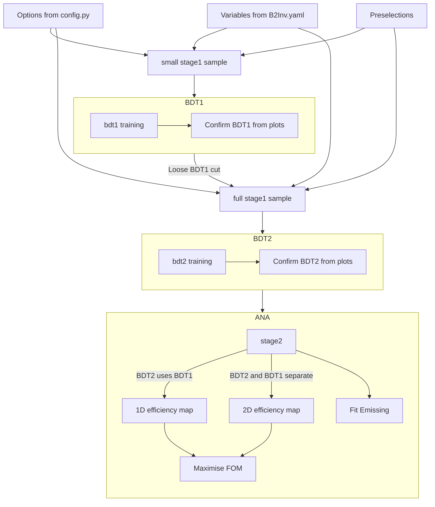

# Workflow overview

# Ideal recreation of project (do not attempt now, WIP)
1. Clone the repo
   
   ```bash
   git clone git@github.com:RMangrulkar/FCCAnalyses.git
   ```
   or
   ```bash
   git clone https://github.com/RMangrulkar/FCCAnalyses.git
   ```
   
2. Set up the environment
   
   ```bash
   cd FCCAnalyses
   git switch b2inv
   source setup.sh
   fccanalysis build -j 8
   cd examples/FCCee/flavour/B2Inv/
   ```
   
3. Save the stage1 training sample (defaults to `outputs/stage1_training`)
   ```bash
   fccanalysis run stage1_training.py
   ```
4. Train BDT using `outputs/stage1_training`. All results saved to `outputs/bdt1out/`
   ```bash
   python bdt1.py --method gridsearch --save-hyperparams --save-model --plot-results
   ```
5. Save the final stage1 sample (defaults to `outputs/stage1`)
   ```bash
   fccanalysis run stage1.py
   ```
6. Automated merging of background `.root` files (2000\+ which contain ~500 events each) \- WIP
   - Something to the effect of:
        ```
        #!/bin/bash
        cd outputs/stage1
        for directory in [bb, cc, ss, ud]
            bin file number into bins of 250 files
            hadd -v 0 -k -fk chunk_0.root chunk_{bin1}.root (0 to 249)
            hadd -v 0 -k -fk chunk_1.root chunk_{bin2}.root (250 to 499)
            ...
        end
        ``` 
7. Train BDT2 using `outputs/stage1`. All results saved to `outputs/bdt1out/`
    ```bash
    python bdt2.py --method gridsearch --nchunks {`default-files`} --save-hyperparams --save-model --plot-results
    ```
8. Apply BDT2 to the rest of stage1 (or in the future save ntuples from raw files again)
    ```bash
    python bdt2-apply.py --load-model {`default-location`} --nchunks {`remaining-files`} --with-results
    ```
    or
    ```bash
    fccanalysis run stage2.py
    python optimiser.py --files {`stage2`}
    ```


# Detailed reference

### Analyzers

Some dedicated C++ functions are added to `FCCAnalyses/analyzers/dataframe/` for this analysis. Right now they are mostly just dumped into `myUtils` (the odd one in some other namespace) in labelled code block. In the future they should be moved to the "correct" namespace depending on functionality/similarity with existing functions.
- TODO: Also need to check if B2Inv specific analyzers should be moved to FCCeePhysicsPerformance
### `config.py`

This contains almost all of the configuration options, most importantly:
- The attributes used by `fccanalysis run` (see [analysis script](https://hep-fcc.github.io/FCCAnalyses/man/latest/fccanalysis-script.html#ATTRIBUTES))
- Path to every important location
  + Path to the YAML file containing variable names
  + Output directory of `fccanalysis run`
  + Location of BDT1 model and other outputs
  + Location of BDT2 model and other outputs
- Dicts of important keys/values
  + Feature list from YAML to use for BDT1
  + Feature list from YAML to use for BDT2
  + Branching fractions
  + Various efficiencies (currently have to manually save)
  + Sample names, their allocation (signal v background), labels to use in plot titles etc

- Maybe the efficiencies should be moved to another YAML so it can be updated separately

### `B2Inv.yaml`

Contains the branch/feature names used in the analysis. Almost every script depends on this and `config.py` in some way or the other.
 - `bdt1-training-opts`
 - `bdt2-training-opts`
 - `stage2-vars` (not used currently)
 - `stage1-vars`
 - `stage0-vars` (may be out of date)

### `stage0.py`

Saves ntuples from the `winter2023` samples for investigation
 - Stores every `MCParticle` and `MCVertex` along with reconstructed variables
 - Also contains some thrust info.
 - Runs over 25\% of the signal and 0.1\% of each background (~2GB each) (WARNING--- `processList` for stage0 currently absent from `config.py`)
 - Currently out of date, may not contain all the variables present in `stage1_training`, `stage1` etc.
 - Tuples are saved in the corresponding path defined in `config`, by default in `outputs/stage0/`.

### `stage1.py` (currently called `stage1_withbdt.py`)

Saves ntuples to either train BDT1 or uses a trained BDT1 to get samples
 - `MCParticle` and `MCVertex` now omitted except special cases (the MC $e^\pm$ beam is stored, as are the MC $Z$, $q$, $\bar{q}$)
 - True MC info associated with `ReconstructedParticles` is also saved, along with the true history (mothers/grandmothers)
 - To run save files in training mode, modify set the flag in config to `True`
 - When saving for training, runs over 30\% of the signal and 1\% of each background by default
 - After getting the training sample, use `bdt1.py` to get a ROOT TMVA file in the correct location
 - `stage1` files obtained by setting training to `False` in config. This adds a branch `EVT_MVA1` and places a loose cut EVT_MVA1 > 0.2
 - By default this step saves all of the signal and 50\% of each background (currently takes multiple days due to vertexing issue)
 - WARNING: features used by BDT1 must be defined in this and must be a part of the `branchList`

 * Would recommend using `hadd -v 1 -k -fk OUTPUT [INPUTS]` to merge these files as I/O operations on 2000+ files slow down subsequent scripts a lot. I merged groups of 250 files manually for now, should be relatively easy to automate. Would recommend using `glob` syntax, for e.g. `chunk_{0..249}.root` to select the first 250.

### `bdt1.py` (currently in the subdirectory `BDT/`)

Uses `stage1_training` data to train and save BDT1
```bash
python bdt1.py --help
```
- Imports attributes from config (as you can see this is a common theme at this point)
- Saves to `outputs/bdt1out/` by default
- The trained model is saved to a JSON (to load back in xgboost) and a ROOT TMVA file (to load in PyROOT)
- BDT can be trained using either `GridSearchCV` to find optimum hyperparameters, or using `xgboost.fit` with fixed values
- Due to the slow running of the xgboost version bundled with `key4hep`, recommended to use gridsearch over fewer chunks, save the optimum hyperparameters and then load those hyperparameters for the full fit
- Optionally, you can plot the response, significance, etc.

### `tuple-handler.py` (needs to be refactored)
 - The `TupleHandler` class is meant to provide a modular way to access `stage0` files (and in the future all
   processed ntuples) to selectively store, display, or plot relevant variables.
 - Expected to work as `variable_plotter.py` but with much greater functionality
   - `get_branch_data` for cuts
   - `get_branches_from_recp` to get corresponding MC data of reconstructed particles

### Variable Plotting

 - `variable_plotter.py` is a simple plotting script that reads from `config.py`
 - example usage `python -i variable_plotter.py` then can interactively make some plots

### `efficiency-finder.py`

 - A simple script that prints (or saves) the efficiencies of a given cut
 - The `efficiencies` function performs the calculation

 Given the number of events after the cut $k$ and the number
 before the cut $n$, the efficiency is
 $$
 \epsilon = \frac{k}{n}
 $$

 with variance
 $$
 \sigma_\epsilon^2 = \frac{(k+1)(k+2)}{(n+2)(n+3)} - \left(\frac{k+1}{n+2}\right)^2
 $$

 This is from assuming that $\exists$ a "true" efficiency and the probability that $k$ events
 survive the cut is a binomial distribution

 $$
 P(k | n) = nCk \epsilon_\text{true}^k (1-\epsilon_\text{true})^{n-k}
 $$
